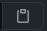

# Description - Chris Martinez - Portfolio

This is an original application to showcase some of my feature work and provide contact information for prospective employers

Link to deployed application: [https://cbmartinez42.github.io/cbm-portfolio-2/](https://cbmartinez42.github.io/cbm-portfolio-2/)

## Features
* Fully responsive application changes features to optimize content based on a variety of devices
* Utilized blur and overlay effects to enhance example screenshots

## Technical details
* Materialize CSS framework was used to optimize grid layout as well as image content

### Challenges
* This is my first use of Materialize CSS. In the process, I learned a lot about this new framework
* I had challenges with aligning content in a way that was both attractive and scalable 
    * I practiced Google-fu and reached out to other developers for input on overlays and grid layout

## Credits
Many thanks to the below individuals who provided input and suggestions
* Mim Armand
* Stephen Simone
* And last, but not least - *Grogu*
        

If any additional issues are found, or if there are any suggestions for improvement, please send an email to site developer Chris Martinez at cbmartinez42@gmail.com

---

### <ins>Installation</ins>
1.  Clone or download .zip file from Github to your local computer
2.  Open index.html via your preferred browser or code/text editor

#### <ins>Cloning</ins>
1. From Github, select the "Code" button, choose either HTTPS or SSH as appropriate
2. Click the copy button  to add it to your clipboard
3. In your preferred command line (terminal, bash, etc), navigate to the folder you'd like to download the repository into
4. Type `git clone [pasted url from clipboard]` and press enter
5. Access the content with your code editor by either typing `code .` in your command line or by using your editor's `File > Open Folder` in your code editor menu. If only viewing in a browser, simply double click index.html to open in your default browser

#### <ins>Zip file</ins>
1. From Github, select the "Code" button, then select "Download ZIP"
2. Choose which folder to download the repository into via the dialog box that appears
3. After downloading, open the .zip file and select "Extract All" from the top of the window that appears
4. Access the content with your code editor by selecting `File > Open Folder` in your code editor menu. If only viewing in a browser, simply double click index.html to open in your default browser

---

This application is covered under [GNU General Public License v3.0](./LICENSE)

## Screenshot below:

